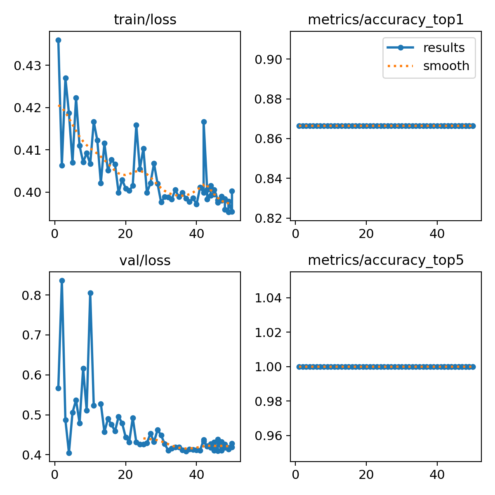
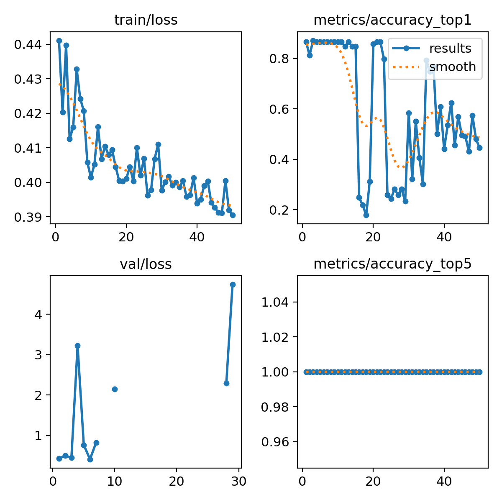
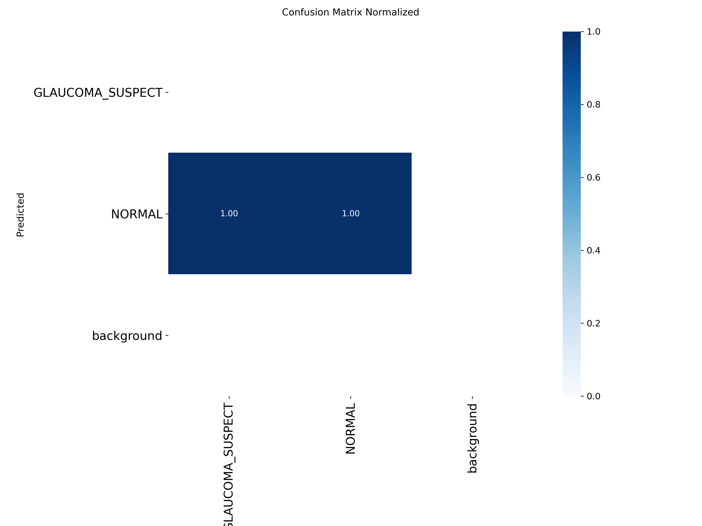
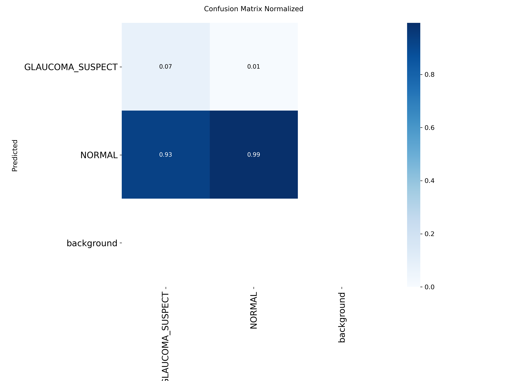

# YOLO11 Glaucoma Classification — Training Report (Full Dataset)

## 1. Objective

Binary classification of fundus images into **NORMAL** vs **GLAUCOMA SUSPECT** using YOLO11 classification models, trained on the Chaksu dataset with images from **all three fundus cameras** — Remidio, Bosch, and Forus.

---

## 2. Dataset Overview

### 2.1 Source — Chaksu Dataset (ID: 20123135)

Data was collected from **three fundus camera systems**. Each image was labelled by **5 expert ophthalmologists**, and the final ground truth was determined by **majority voting** (≥ 3 out of 5 experts agree).

| Camera | CSV File | Images in CSV | Matched on Disk | NORMAL | GLAUCOMA SUSPECT | Glaucoma % |
|--------|----------|:-------------:|:---------------:|:------:|:----------------:|:----------:|
| **Remidio** | `remidio_images_updated.csv` | 810 | **810** | 708 | 102 | 12.6 % |
| **Bosch** | `bosch_data.csv` | 104 | **103** | 84 | 19 | 18.4 % |
| **Forus** | `forus_data.csv` | 95 | **95** | 79 | 16 | 16.8 % |
| **Total** | — | **1,009** | **1,008** | **871** | **137** | **13.6 %** |

> [!NOTE]
> The **full dataset of 1,008 images** from all three cameras is used. Only 1 Bosch image (`Image172.JPG`) was missing from disk.

### 2.2 Class Imbalance

The dataset is **heavily imbalanced** — approximately **86.4 % NORMAL** and **13.6 % GLAUCOMA SUSPECT**.

---

## 3. Data Preparation Pipeline

Implemented in [retrain_fulldata.py](file://retrain_fulldata.py).

### 3.1 Steps

1. **CSV Loading** — All three camera CSVs loaded and merged using `pd.concat`
2. **Image Path Resolution** — Image filenames mapped to actual file paths under `1.0_Original_Fundus_Images/{Camera}/`
3. **Existence Filtering** — Only images physically present on disk were retained → **1,008 usable images**
4. **Label Cleaning** — `Majority Decision` column used as-is (NORMAL / GLAUCOMA SUSPECT), spaces replaced with underscores for folder names
5. **Stratified Train/Test Split** — Using `sklearn.model_selection.train_test_split`
6. **YOLO Folder Structure** — Images copied into YOLO classification directory format

### 3.2 Train / Test Split

| Parameter | Value |
|-----------|-------|
| Split Ratio | **80 / 20** (Train / Test) |
| Stratification | Yes — by `Majority Decision` |
| Random Seed | `42` |
| **Train Images** | **806** |
| **Test Images** | **202** |

#### Per-Class Breakdown

| Class | Train | Test | Total |
|-------|:-----:|:----:|:-----:|
| NORMAL | 696 | 175 | 871 |
| GLAUCOMA SUSPECT | 110 | 27 | 137 |
| **Total** | **806** | **202** | **1,008** |

### 3.3 Output Directory Structure

```
/home/abhay/yolo_glaucoma_cls/
├── train/
│   ├── NORMAL/          (696 images)
│   └── GLAUCOMA_SUSPECT/ (110 images)
└── test/
    ├── NORMAL/          (175 images)
    └── GLAUCOMA_SUSPECT/ (27 images)
```

> [!NOTE]
> No separate validation split was created. The test set was used for validation during training (Ultralytics auto-fallback: `split=val` not found → used `split=test`).

---

## 4. Training Configuration

Two models were trained — **YOLO11s-cls** (Small) and **YOLO11l-cls** (Large).

### 4.1 Common Hyperparameters

| Parameter | Value |
|-----------|-------|
| Framework | Ultralytics 8.4.11 |
| Task | Classification (`classify`) |
| Image Size | **1024 × 1024** |
| Rect Mode | `True` (preserve aspect ratio) |
| Batch Size | **1** |
| Epochs | **50** |
| Optimizer | **AdamW** (auto-selected) |
| Learning Rate | `0.001667` (auto) |
| Momentum | `0.9` |
| Weight Decay | `0.0005` |
| AMP | Enabled (Mixed Precision) |
| Pretrained | **Yes** (ImageNet weights) |
| Augmentation | RandAugment, HSV jitter, horizontal flip, erasing (0.4), scale (0.5) |
| Early Stopping | Patience = 100 (not triggered) |
| Device | **NVIDIA RTX 2000 Ada Generation** (16 GB VRAM) |
| Workers | 0 (YOLO11s), 8 (YOLO11l) |
| Seed | 0 (deterministic) |

> [!NOTE]
> Multiple Bosch camera JPEGs were flagged as corrupt during loading but were **automatically restored and saved** by Ultralytics. YOLO11s used `workers=0` to avoid a data-loader crash caused by a PNG read error during multi-process loading.

---

## 5. Model Architectures

| Spec | YOLO11s-cls (Small) | YOLO11l-cls (Large) |
|------|:-------------------:|:-------------------:|
| Layers | 86 (47 fused) | 176 (94 fused) |
| Parameters | **5.45 M** | **12.84 M** |
| GFLOPs | 12.1 | 49.8 |
| Model Weight Size | 11.0 MB | 25.9 MB |
| Pretrained Transfer | 234/236 items | 492/494 items |

---

## 6. Results

### 6.1 Final Best-Model Metrics

| Metric | YOLO11s-cls (Small) | YOLO11l-cls (Large) |
|--------|:-------------------:|:-------------------:|
| **Top-1 Accuracy** | **86.63 %** | **87.13 %** |
| **Top-5 Accuracy** | **100.0 %** | **100.0 %** |
| Best Epoch | All epochs (constant) | Epoch 3 |
| Training Time | ~1.64 hrs (50 epochs) | ~0.56 hrs (50 epochs) |

> [!WARNING]
> **Both models show signs of predicting mostly the NORMAL class.** The YOLO11s accuracy is **exactly 86.63%** (= 175/202, the proportion of NORMAL in the test set) across every single epoch, indicating it is learning only the majority class baseline. YOLO11l briefly exceeded this at epoch 3 (87.13%) but then became extremely unstable with val/loss going to NaN and accuracy dropping to random levels (17–86%).

### 6.2 Inference Speed (per image)

| Stage | YOLO11s-cls | YOLO11l-cls |
|-------|:-----------:|:-----------:|
| Preprocess | 1.4 ms | ~1.3 ms |
| **Inference** | **6.1 ms** | **13.0 ms** |
| Postprocess | ~0.006 ms | ~0.006 ms |

### 6.3 Training Loss Progression

| Epoch | YOLO11s Train Loss | YOLO11l Train Loss |
|:-----:|:------------------:|:------------------:|
| 1 | 0.436 | 0.441 |
| 10 | 0.407 | 0.401 |
| 25 | 0.410 | 0.407 |
| 40 | 0.397 | 0.394 |
| 50 | 0.400 | 0.391 |

### 6.4 Validation Accuracy Across Epochs (Key Observations)

**YOLO11s-cls:**
- Accuracy was **constant at 86.63%** across all 50 epochs
- Validation loss gradually decreased from 0.567 → 0.410 but accuracy never changed
- The model is **stuck predicting the majority class** (NORMAL) for all inputs

**YOLO11l-cls:**
- Peaked at **87.13%** at epoch 3 (slightly above baseline)
- Then became **extremely unstable**: accuracy dropped to 17–25% from epochs 16–29
- Validation loss went to **NaN** from epoch 8 onwards (persistent numerical instability)
- Occasionally recovered to 86.6% but never consistently

### 6.5 Training Curves

````carousel

<!-- slide -->

````

### 6.6 Confusion Matrices (Normalized)

````carousel

<!-- slide -->

````

### 6.7 Runs1 — Precision, Recall & F1-Score

Computed from the **best-model confusion matrices** above (test/val set, N = 202).

#### Confusion Matrix Values (Absolute Counts)

| | **True: GLAUCOMA SUSPECT** | **True: NORMAL** |
|---|:---:|:---:|
| **YOLO11s — Pred: GLAUCOMA SUSPECT** | 0 (TP) | 0 (FP) |
| **YOLO11s — Pred: NORMAL** | 27 (FN) | 175 (TN) |
| **YOLO11l — Pred: GLAUCOMA SUSPECT** | 2 (TP) | 1 (FP) |
| **YOLO11l — Pred: NORMAL** | 25 (FN) | 174 (TN) |

#### Per-Class Metrics

| Metric | Class | YOLO11s-cls (Small) | YOLO11l-cls (Large) |
|--------|-------|:-------------------:|:-------------------:|
| **Precision** | GLAUCOMA SUSPECT | N/A (0/0 — never predicted) | **66.67 %** (2/3) |
| **Recall** | GLAUCOMA SUSPECT | **0.00 %** (0/27) | **7.41 %** (2/27) |
| **F1-Score** | GLAUCOMA SUSPECT | **0.00 %** | **13.79 %** |
| **Precision** | NORMAL | **86.63 %** (175/202) | **87.44 %** (174/199) |
| **Recall** | NORMAL | **100.00 %** (175/175) | **99.43 %** (174/175) |
| **F1-Score** | NORMAL | **92.84 %** | **93.05 %** |
| **Overall Accuracy** | — | **86.63 %** (175/202) | **87.13 %** (176/202) |

> [!WARNING]
> **Runs1 YOLO11s-cls never predicted GLAUCOMA SUSPECT** — all 202 images were classified as NORMAL, giving Recall = 0% for the positive class. **YOLO11l-cls detected only 2 of 27 glaucoma suspects** (Recall ≈ 7.4%), with 1 false positive. Both models are essentially predicting the majority class.

---

## 7. Runs2 — Retrained with Tuned Hyperparameters(epochs=300, batchsize =16 , imgsze=512)


### 7.1 What Changed (Runs1 → Runs2)

The first run (Runs1) showed both models were either stuck at the majority-class baseline or numerically unstable. The key hypothesis was that **batch size = 1 with 1024px images produced noisy gradients** and prevented learning. A second training run (**Runs2**) was conducted with the following changes:

| Parameter | Runs1 (Previous) | **Runs2 (Latest)** | Rationale |
|-----------|:-----------------:|:-------------------:|-----------|
| **Epochs** | 50 | **300** | Allow more time for convergence |
| **Image Size** | 1024 × 1024 | **512 × 512** | Reduce memory per sample |
| **Batch Size** | 1 | **16** | Smoother gradients, better class statistics per batch |
| Training Script | [retrain_fulldata.py](file://retrain_fulldata.py) | [retrain_fulldata_v2.py](file://retrain_fulldata_v2.py) | — |

> [!IMPORTANT]
> The dataset (1,008 images, 80/20 stratified split, seed=42) was **identical** to Runs1. Only the training hyperparameters changed.

### 7.2 Runs2 — Final Best-Model Metrics

| Metric | YOLO11s-cls (Small) | YOLO11l-cls (Large) |
|--------|:-------------------:|:-------------------:|
| **Top-1 Accuracy** | **93.07 %** | **86.63 %** |
| **Top-5 Accuracy** | **100.0 %** | **100.0 %** |
| Best Epoch | ~185–285 (multiple peaks) | All epochs (constant) |
| Epochs Completed | 285 (early-stopped, patience=100) | 101 (early-stopped, patience=100) |
| Training Time | ~5.81 hrs | ~2.05 hrs |

### 7.3 YOLO11s-cls (Small) — Detailed Observations

- **Major improvement**: Accuracy broke out of the 86.63% majority-class baseline starting around **epoch 55**, reaching **88.6%**
- Continued climbing through training: **90.6%** by epoch 90, **91.1%** by epoch 126, **92.6%** by epoch 176, and peaked at **93.07%** at epochs 185, 192, 200, 210, 216, 241, 246–249, 262, 269, and 283
- Training loss dropped steadily from **0.49 → 0.15** (vs 0.44 → 0.40 in Runs1), showing genuine feature learning
- Validation loss decreased from **0.87 → 0.25** on average, though with some oscillation
- The model successfully learned to **distinguish GLAUCOMA SUSPECT from NORMAL** — unlike Runs1 where it predicted only the majority class

#### Training Loss Progression (YOLO11s-cls)

| Epoch | Train Loss | Val Accuracy | Val Loss |
|:-----:|:----------:|:------------:|:--------:|
| 1 | 0.490 | 86.63 % | 0.872 |
| 50 | 0.385 | 86.63 % | 0.318 |
| 100 | 0.321 | 87.13 % | 0.300 |
| 150 | 0.313 | 89.11 % | 0.275 |
| 200 | 0.252 | 93.07 % | 0.269 |
| 250 | 0.180 | 92.08 % | 0.230 |
| 285 | 0.175 | 92.57 % | 0.326 |

### 7.4 YOLO11l-cls (Large) — Detailed Observations

- **No improvement**: Accuracy stayed at **86.63% (majority-class baseline)** for nearly all 101 epochs, with brief dips to 83.66% and 85.64%
- **Validation loss went to NaN** on 9 separate occasions (epochs 11, 43, 48, 57, 59, 85, 88, 96, 98, 99), indicating persistent numerical instability
- Training loss **plateaued** around 0.39–0.41 with no meaningful decrease even after 100 epochs
- **Early-stopped at epoch 101** because accuracy never improved beyond the initial baseline (patience=100 exhausted)
- The larger model **completely failed to learn** meaningful features despite the improved batch size and longer training — likely overwhelmed by its 12.84M parameters on a small, imbalanced dataset

### 7.5 Runs2 Training Curves

````carousel

<!-- slide -->

````

### 7.6 Runs2 Confusion Matrices (Normalized)

````carousel

<!-- slide -->

````

### 7.7 Runs2 — Precision, Recall & F1-Score

Computed from the **best-model confusion matrices** above (test set, N = 202).

#### Confusion Matrix Values (Absolute Counts)

| | **True: GLAUCOMA SUSPECT** | **True: NORMAL** |
|---|:---:|:---:|
| **YOLO11s — Pred: GLAUCOMA SUSPECT** | 16 (TP) | 3 (FP) |
| **YOLO11s — Pred: NORMAL** | 11 (FN) | 172 (TN) |
| **YOLO11l — Pred: GLAUCOMA SUSPECT** | 0 (TP) | 0 (FP) |
| **YOLO11l — Pred: NORMAL** | 27 (FN) | 175 (TN) |

#### Per-Class Metrics

| Metric | Class | YOLO11s-cls (Small) | YOLO11l-cls (Large) |
|--------|-------|:-------------------:|:-------------------:|
| **Precision** | GLAUCOMA SUSPECT | **84.21 %** (16/19) | N/A (0/0 — never predicted) |
| **Recall** | GLAUCOMA SUSPECT | **59.26 %** (16/27) | **0.00 %** (0/27) |
| **F1-Score** | GLAUCOMA SUSPECT | **69.57 %** | **0.00 %** |
| **Precision** | NORMAL | **93.99 %** (172/183) | **86.63 %** (175/202) |
| **Recall** | NORMAL | **98.29 %** (172/175) | **100.00 %** (175/175) |
| **F1-Score** | NORMAL | **96.09 %** | **92.83 %** |
| **Overall Accuracy** | — | **93.07 %** (188/202) | **86.63 %** (175/202) |

> [!WARNING]
> **YOLO11l-cls (Large) never predicted GLAUCOMA SUSPECT** — all 27 glaucoma-suspect images were misclassified as NORMAL, giving **Recall = 0%** for the positive class. Its 86.63% accuracy is exactly the majority-class baseline. **YOLO11s-cls correctly identified 16 of 27 glaucoma suspects** (Recall ≈ 59%), with only 3 false positives out of 175 normal images (FP rate = 1.7%).

---

## 8. Full Comparison: Runs1 vs Runs2

| Metric | Runs1 YOLO11s | Runs1 YOLO11l | **Runs2 YOLO11s** | **Runs2 YOLO11l** |
|--------|:------------:|:------------:|:-----------------:|:-----------------:|
| Epochs | 50 | 50 | **285** (early-stop) | **101** (early-stop) |
| Image Size | 1024 | 1024 | **512** | **512** |
| Batch Size | 1 | 1 | **16** | **16** |
| **Top-1 Accuracy** | 86.63 % | 87.13 % | **93.07 %** ✅ | 86.63 % ❌ |
| **Glaucoma Recall** | 0.00 % | 7.41 % | **59.26 %** ✅ | 0.00 % ❌ |
| **Glaucoma Precision** | N/A | 66.67 % | **84.21 %** ✅ | N/A ❌ |
| **Glaucoma F1** | 0.00 % | 13.79 % | **69.57 %** ✅ | 0.00 % ❌ |
| Best Epoch | All (constant) | 3 | ~185+ | — (never improved) |
| Train Loss (final) | 0.400 | 0.391 | **0.175** | 0.403 |
| Val Loss Stability | Stable | NaN (severe) | Stable | NaN (9 occurrences) |
| Behaviour | Majority-class only | Unstable / NaN | **Genuine learning** | Majority-class only |

> [!TIP]
> **Runs2 YOLO11s-cls is the clear winner.** The combination of batch=16 and imgsz=512 enabled the small model to break past the majority-class baseline and achieve **93.07% accuracy with 59.26% glaucoma recall** — a **+6.44 percentage point improvement** in accuracy and from 0% to 59% recall. The larger model, paradoxically, performed worse.

---

## 9. Summary & Key Takeaways

| # | Finding |
|---|---------|
| 1 | **Runs1**: Both models were stuck at or near the majority-class baseline (86.63%). YOLO11s predicted only NORMAL; YOLO11l had severe NaN instability |
| 2 | **Runs2 hyperparameter changes**: epochs 50→300, imgsz 1024→512, batch 1→16 — addressing the noisy-gradient hypothesis |
| 3 | **YOLO11s-cls (Runs2) achieved 93.07% accuracy** — up from 86.63%, breaking out of majority-class prediction and genuinely learning to classify GLAUCOMA SUSPECT |
| 4 | **YOLO11l-cls (Runs2) failed completely** — stayed at 86.63% baseline for all 101 epochs (patience exhausted), with recurring NaN val/loss. The 12.84M-parameter model appears too large for this small, imbalanced dataset |
| 5 | **Smaller model outperformed larger model** — YOLO11s (5.45M params) benefited from tuning while YOLO11l (12.84M params) remained stuck, suggesting the dataset size is insufficient for the larger architecture |
| 6 | **Class imbalance remains a concern** — even at 93.07%, further gains may require class weighting, oversampling, or focal loss |

---

## 10. File References

| File | Description |
|------|-------------|
| [retrain_fulldata.py](file://retrain_fulldata.py) | Runs1 training script (epochs=50, imgsz=1024, batch=1) |
| [retrain_fulldata_v2.py](file://retrain_fulldata_v2.py) | Runs2 training script (epochs=300, imgsz=512, batch=16) |
| [model_train_fulldata.ipynb](file://6.0_Glaucoma_Decision/model_train_fulldata.ipynb) | Original training notebook |
| [remidio_images_updated.csv](file://6.0_Glaucoma_Decision/remidio_images_updated.csv) | Remidio camera labels (810 images) |
| [bosch_data.csv](file://6.0_Glaucoma_Decision/bosch_data.csv) | Bosch camera labels (104 images) |
| [forus_data.csv](file://6.0_Glaucoma_Decision/forus_data.csv) | Forus camera labels (95 images) |
| [Runs1 YOLO11s results](file://6.0_Glaucoma_Decision/runs/classify/train_full_s) | Small model Runs1 outputs |
| [Runs1 YOLO11l results](file://6.0_Glaucoma_Decision/runs/classify/train_full_l) | Large model Runs1 outputs |
| [Runs2 YOLO11s results](file://6.0_Glaucoma_Decision/runs2/train_full_s) | Small model Runs2 outputs |
| [Runs2 YOLO11l results](file://6.0_Glaucoma_Decision/runs2/train_full_l) | Large model Runs2 outputs |
